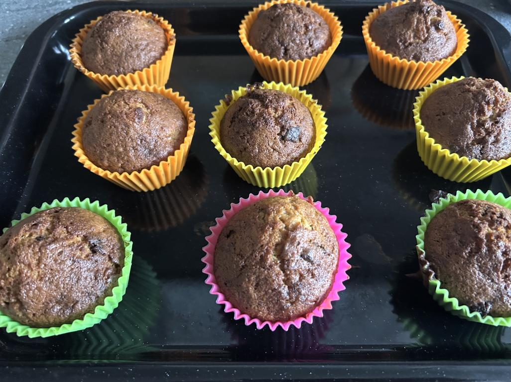

# Choc-chip Banana Muffins

This recipe is an excellent way to use up any over-ripe bananas you may have.

## Before you start

You will need:
* a large mixing bowl
* a spoon & fork
* kitchen scales
* 20 muffin cases, e.g. [ProCook Silicone Muffin Cases](https://www.procook.co.uk/product/procook-silicone-large-muffin-cases-6-piece)
* baking tray.
* an oven

## Ingredients

* 400g peeled ripe bananas (about 5 medium-large)
* 50g butter
* 200g Self raising flour
* 175g caster sugar
* 2 large eggs
* ¼ tsp Bicarbonate of soda
* ½ tsp salt
* 75g chocolate chips

## Instructions

1. Start pre-heating the oven to 180°C.
2. Mash the bananas & butter into the bowl with a fork.
3. Add the flour, bicarb', salt, sugar and eggs, and mix until smooth.
4. Add the chocolate chips to the mix, and stir in.
5. Spoon the mix into the muffin cases, so each is about half full. (about 50g per case)
6. Put the muffins on a baking tray, or similar, and cook in the oven for 30 minutes at 180°C.

## Notes

At 50g mix per case, each muffin is about 150kcal.
