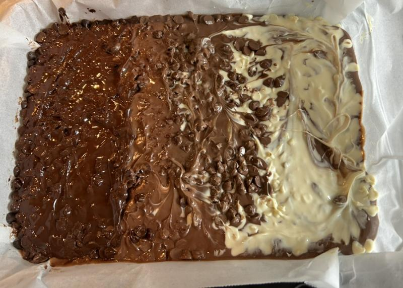

# Martian Shortbread

This is a variant on Millionaire's shortbread, but instead of a caramel centre it uses Mars Bars instead. This particular recipe is also a bit of a cheat because the base is not really shortbread - But it is easier to make if you're feeling lazy. If you want a property short bread base use [Granny's shortbread recipe](shortbread.md) for the base.

This is the Martian Shortbread as the choc chips are partially smoothed out and still melting on the top layer. A mix of dark, milk and white choc chips were used in sections with some overlap.

## Before you start

You will need:

* Baking parchment / Grease proof paper
* A deep baking tray or dish about 600cm² (e.g. 20cm x 30cm - If you're eyeballing it, it is roughly the size of an A4 sheet of paper)
* Sauce pan
* Wooden spoon
* Table or dessert spoon.
* For the base:
  * Food mixer
  * Cup

## Ingredients

* For the base:
  * 400g Digestive biscuits
  * 200g unsalted butter
* For the centre
  * 400g Mars Bars
  * 397g tin of sweetened condensed milk
* For the top
  * 300g cooking chocolate (dark, milk or white choc to your preference)

## Instructions

1. Make the base
    1. Put the digestive biscuits into a food processor and mix until it has broken down to a sand like mixture.
    2. Melt the butter (microwave in a cup for 1 minute works quickly if taking directly from the fridge), then mix into to digestive biscuits
    3. Line the baking tray with the grease proof paper.
    4. pour the digestive biscuit/butter mix into the baking tray and smooth out to the edges, use a clean flat bottomed cup to press down evenly.
    5. Put in to the fridge to cool while you get on with the filling.
2. Make the filling
    1. Pour the sweetened condensed milk into a sause pan on a low heat.
    2. Cut the Mars Bars into small chunck and gradually add them into the pan letting each few chunks mostly melt before adding the next lot.
    3. Stir the mix on a low heat until the Mars Bars are fully melted into the mix and the liquid is thick and smooth. This will probably take about 10-15 minutes
    4. Keeping the pan on a low heat, get the now cool base from the fridge. Then pour the Mars Bar mix onto the base and ensure that mix goes right to the edges of the tray.
3. Add the chocolate topping
    * (If using chocolate chips)
        1. Sprinkly the chocolate chips evenly over the still hot Mars Bar filling
        2. Wait about a minute-or-so to allow the choc chips to start to melt.
        3. Use the back of a table or dessert spoon to smooth the chocolate chips as they melt over the top of the warm filling layer
    * (If using cooking chocolate slabs, or the filling has cooled already)
        1. Melt the chocolate slowly in a pan until you have a smooth thick liquid.
        2. Pour the melted chocolate over the filling layer and using the back of a table or dessert spoon smooth over ensuring that it gets to the edge of the tray.
4. Return the tray to the fridge and allow to cool.
5. Cut into 3cm wide squares.

Store in the fridge.

## Notes

A 3cm square is about 150-170 kcal.