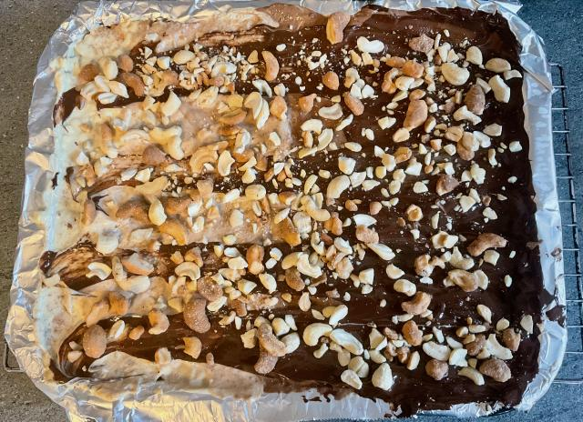

This is a variant of the [Christmas Crack](https://www.youtube.com/shorts/BRQ7vVSw06o) recipe in B. Dylan Hollis's book [Baking Yesteryear](https://www.amazon.co.uk/Baking-Yesteryear-Recipes-1900s-1980s/dp/0744080045/ref=asc_df_0744080045).

Why did I call it "Millionaire's"? This variant takes the original recipe and makes it closer to a Millonaire's Shortbread.

What's it got to do with Christmas? No idea - Feel free to have this at any time of year. 😃

## Before you start

You will need

* Oven pre-heated to 150℃ (300℉)
* A set of kitchen scales.
* A baking tray (25x32cm - or about 800cm²)
* Baking foil
* Food mixer
* Large saucepan
* Wooden spoon
* Table spoon

## Ingredients

Base:
* 225g Butter
* 500g Digestive biscuits

Caramel centre:
* 275g Butter
* 280g Soft brown sugar

Topping:
* 300g Cooking chocolate chips
* 150g Cashews

## Instructions

Create the base
1. Preheat the oven to 150℃ (300℉)
2. Line the baking tray with the foil.
3. Mix the Digestive biscuits and butter in a food mixer.
4. Pour the mix into the foil lined baking tray.
5. Pat down the mix until it covers the entire base of the tray and is realatively flat.
6. Bake in the oven for about 10-15 minutes.

While the base is baking, create the caramel centre
1. Put the butter and sugar in a saucepan and heat, stiring occasionally with the wooden spoon.
2. Once the mixture starts to boil stop stirring and leave it to boil for 5 minutes. Once the time is up reduce the heat, but do not allow to cool or it will start to set.
3. By this time the base should be ready.
4. Remove the base from the oven and increase the temperature to 180℃ (350℉)
5. Quickly pour the caramel sauce over the base and spread to the edges using the back of the wooden spoon. (Caution: The caramel mix will be very hot)
6. Return to the over for a further 7 minutes.

Add the topping
1. While the second baking session it ongoing, crush/break-up the cashews into smaller pieces. They don't have to be evenly crushed, just enough to make a variety of sizes. You can reuse the food mix for this and pulse the motor so as not to overly break up the nuts.
2. When the second baking session is complete remove from the oven and immediately scatter the choc chips evenly over the top.
3. After a couple of minutes the heat from the base will have melted the chocolate making it easier to spread out with the back of a table spoon.
4. Scatter the cashews over the top of the chocolate
5. Allow to cool to room temperature and then in the fridge.
6. Once cooled, remove from the fridge and cut in to squares (about 5x5cm - This should get you about 30 squares)

## Notes

* Boiling sugar is increadibly hot, ensure your saucepan is large enough that the mixture won't boil over. (I didn't accidentally burn myself on molten sugar. Not me! Not at all 🙈)
* You can get a mix of dark, milk and/or white cooking chocolate and spread them in lanes or swirls over the top so you get a mix of toppings.
* Each 5x5cm portion is about 320 kcal.
* You can replate the cashews with a more desirable topping if you prefer. Mini M&Ms work well if you prefer it even sweeter.