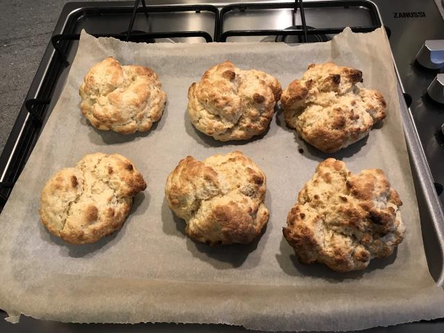

# Plain Scones

Plain scones are good for a wide range of things, you can butter them, add clotted cream and jam to them, or add savory toppings.

## Before you start

You will need:

* sieve
* baking tray
* grease proof paper
* large mixing bowl
* butter knife
* mixing spoon (a table spoon will do)
* scales
* measuring jug

## Ingredients

* 450g self-raising flour
* 75g caster sugar
* a pinch of salt
* 100g butter (direct from fridge)
* 250ml Milk (whole or buttermilk is best)

## Instructions

1. Preheat the oven to 220°C
2. Sieve the flour and sugar into the large mixing bowl.
3. Add a pinch of salt
4. Cut the butter into small chunks (maybe about 1-2cm²)
5. One chunk at a time, with your fingers gently rub the butter into the flour mix. Keep it a light touch, this may take some time as you don't want to over work the mixture.
6. Once all the butter is worked in and there are no lumps left slowly mix in the milk. You want to do this slowly a wee bit milk at a time (maybe 25ml at a time). You don't want the mixture to become too wet. You might end up with a little left over milk at the end, or you might needs a wee bit more. You have mixed enough milk when there is no dry flour left in the bowl.
7. Portion the mix into 6-10 pieces depending on the size of scone that you want. If you are rolling them in to a ball remember to keep it gentle. 
8. Put the grease proof paper on the baking tray and place the dough-balls on the paper.
9. Bake in the oven for 10-12 minutes.

## Notes

If you don't have self-raising flour then plain flour and a teaspoon of baking powder will do as a replacement.

Scones are often best eaten while warm, or at least the same day, but can last a day or two, although they will start to get harder.

Instead of rolling the mix into dough balls, you can put the mix on a chopping board, gently flatten out to about 3-5cm thick and use cookie cutters.