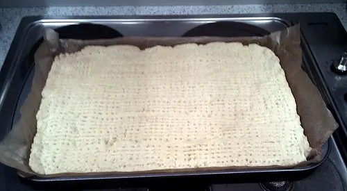
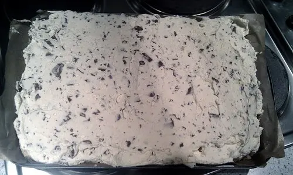

This is not so much a cake as a shortbread base with a sweet dairy topping. It serves many people and ideal as a party food. This recipe produces 20 servings.

## Ingredients

- 250g of softened butter or margarine
- 150g granulated sugar
- 450g plain flour
- 500ml double (whipping) cream
- 250g Dime/Daim bars

## Equipment

- Baking tray (25cm x 35cm approx)
- Grease proof paper (optional) cut to fit the baking tray
- Large mixing bowl
- Sieve
- Rolling pin
- Fork
- Fan assisted oven (if not fan assisted, adjust cooking times accordingly)
- Disposable food bag (e.g. a freezer bag)
- Food mallet
- Refrigerator
- Whisk
- Spatula

## Instructions

1. Lightly grease or lay grease proof paper in the baking tray.
2. In a large mixing bowl, cream together the butter/margarine with the sugar until light and fluffy.
3. Sieve the flour into the mixing bowl. Mix everything together until a soft dough is formed.
4. Put the dough on centre of the the grease proof paper (or on a floured surface). Roll out the dough to roughly fit the baking tray. Place in the baking tray and push out to the sides to fill the tray.
5. Prick the surface of the dough evenly several times with a fork. Place the tray in a pre-heated oven at 160°C for approx 30 minutes until the shortbread is crisp and golden in colour.

6. Allow the shortbread time to cool naturally for about an hour or so. Do not refrigerate.
7. Unwrap the Dime/Daim bars and place in a food bag. Use the mallet to smash the Dime/Daim bars into small pieces of varying sizes (no more than about 1cm?;)
8. Pour the double (whipping) cream into a (new/cleaned) mixing bowl and whisk until the mix starts to firm up.
9. Add the smashed up Dime/Daim bars to the cream and mix together.
10. Using a spatula spread the cream mix over the shortbread base.

11. Place the baking tray in a refrigerator and allow to cool.
When ready to serve cut into rectangles of the desired size. You should expect to get about 20 pieces from the tray (4 x 5 grid)
