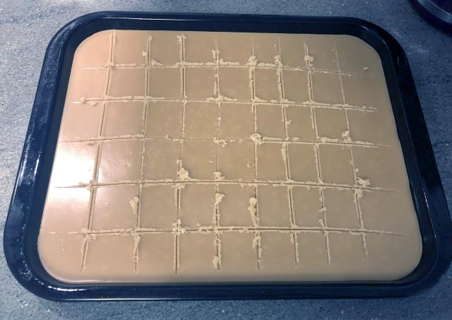

## Scottish Tablet

This requires a bit of patience as you have to watch the cooking process a lot as it burns easily.

### Before you start

You will need:
* a large non-stick pan,
* wooden spoon,
* a food thermometer,
* a sieve, and
* a baking tray around 40cm by 20cm by a couple of centimetres deep.

### Ingredients

* 900g Golden caster sugar (although regular caster sugar will do),
* 250ml Full fat milk (must be full fat),
* 125g butter for pan + however much to grease the tray, and 
* 397g tin of condensed milk.

### Instructions

1. Grease the baking tray with a generous amount of butter and set aside.
2. Put the milk in the pan on a gentle heat.
3. Slowly sieve the sugar into the pan, stirring into the milk until the sugar has dissolved.
4. Add the butter and allow it to melt.
5. Mix in the condensed milk.
6. When all is mixed well together, increase the heat and stir continuously.
7. As you are stirring the mixture monitor the temperature, keep stirring until it reaches 120°C. This step will take a while. The mixture has to be stirred continuously in case it burns.
8. Remove from the heat, and beat the mixture. It will get more difficult as it starts to cool.
9. When it starts setting, pour into the greased tray you made up earlier. Spread to the corners of the tray. It will probably set faster as it hits the cooler tray, so be quick.
10. After a short while (15-30 minutes) you can score lines into the tablet. Note, you are not cutting it yet, just scoring roughly 2mm deep lines where you want the tablet to be cut later on.
11. Allow to cool for a few hours (overnight is ideal).
12. Cut the tablet into squares using the score lines you created earlier.

### Notes

**Milk**: Full fat/whole milk is preferred, it makes it easier to work with.

**Butter**: Butter can be salted or unsalted depending on taste. I tend to go for a unsalted or lightly salted butter. If you like salted caramel you might want to go for a more heavily salted butter.

**Stirring**: The wooden spoon can be replaced with anything that is suitable for use with a non-stick pan. Do not use metal.

**Portioning**: You don't have to score lines into the tablet to aid cutting into blocks later on. If you don't, you'll get unevenly sized and shaped pieces of tablet which gives it a more home made feel to it. It's not so easy to package and post to friends.

